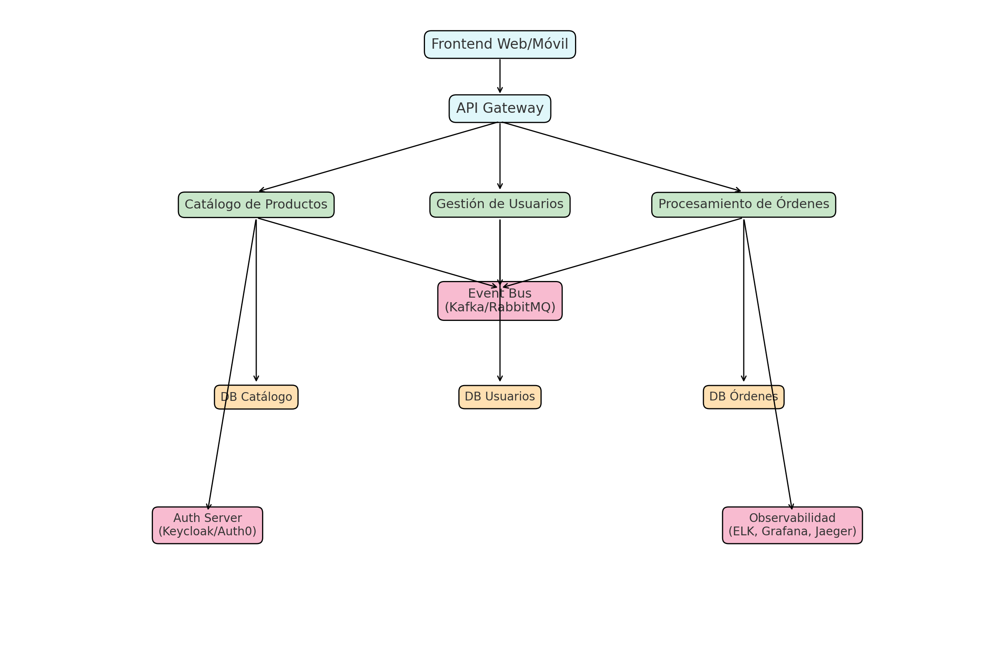

# Decisión de Arquitectura y Plan de Migración – Monolito a Microservicios

Este repositorio contiene los entregables de la prueba técnica de Arquitecto de Software.

## 📂 Contenido
- `docs/decision_arquitectura.docx`: Documento con la propuesta de migración.
- `docs/arquitectura_microservicios_ecommerce.puml`: Diagrama en PlantUML de la arquitectura de alto nivel.
- `docs/arquitectura_microservicios.png`: Versión visual del diagrama en PNG.

## 🖼️ Diagrama de Arquitectura (Vista Rápida)


## ▶️ Cómo visualizar el diagrama
Puedes renderizar el `.puml` a PNG o SVG con [PlantUML](https://plantuml.com/) o usando [Kroki](https://kroki.io/).

Ejemplo en local:
```bash
plantuml -tpng docs/arquitectura_microservicios_ecommerce.puml -o ./docs
```

Ejemplo con Docker:
```bash
docker run --rm -v "$PWD/docs":/workspace plantuml/plantuml -tpng /workspace/arquitectura_microservicios_ecommerce.puml
```

## 🔐 Autor
Leonardo Escobar Osorio – Arquitecto de Software  
Fecha: 29 de Agosto de 2025
